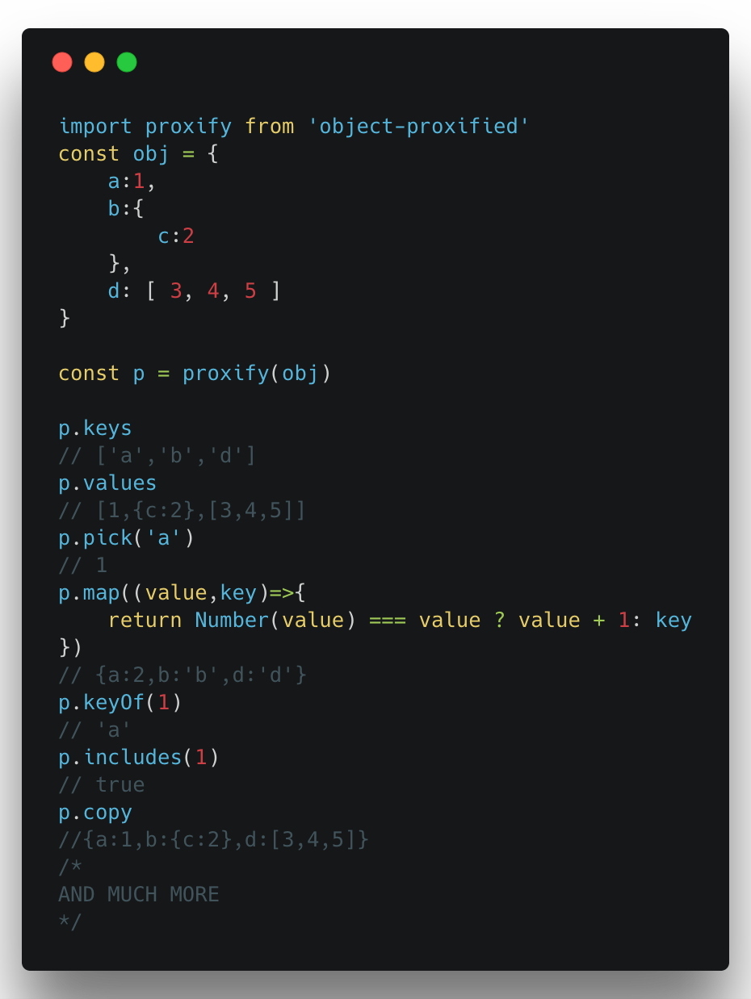

# object-proxified
> This small utility library allows you to put common utility methods onto any object.


> The implementation of several methods the Object class that is missing for all objects


This uses Proxies to add these methods and properties as traps on the specified object.
This adds most of the array methods to an Object allowing you to use your functional programming on objects as well.


## Install

```
$ npm install --save object-proxified
```


## Usage

```js
const proxify = require('object-proxified');
let x = proxify({
	a:1,
    b:{
    	c:4
    },
    d:[1,2,3],
    e:true
})
x.pick('a')
//=> 1
```

## API

### object-proxify([object])

#### object

Type: `object`

Accepts any valid JavaScript Object

### Methods that are now available to all objects

#### pick( query )

##### query

Type: `string or Array of strings`

Returns the value of an object the specified key.
```js
x.pick('a')
//=> 1
```

#### copy( )

Returns a copy of the current object.
```js
let y = proxify({
	a: 3
})
y.copy
//=> { a: 3 }
```

#### extend( objExtendingWith, [ otherObjects , , , ] )

##### objExtendingWith
Type: `Object`
Description: The object whose properties will be copied onto a copy of the current object.

Returns a copy of the current object with `objExtendingWith`'s properties deeply copied onto it. Multiple Objects can be placed in different arguments.
```js
let obj=proxify({
		b:4
    }),
	ext = {
		a: 3
	}
    
obj.extend(ext)
//=> { a: 3, b: 4 }

obj
//=> { b: 4 }
```

#### assign( objExtendingWith, [ otherObjects , , , ] )

##### objExtendingWith
Type: `Object`
Description: The object whose properties will be copied onto the current object.

Merges the current object with `objExtendingWith`'s properties deeply copied onto it. Therefore mutating the current object. Multiple Objects can be placed in different arguments.
```js
let obj=proxify({
		b:4
    }),
	ext = {
		a: 3
	}
    
obj.assign(ext)
//=> { a: 3, b: 4 }

obj
//=> { a: 3, b: 4 }
```

#### remove( query )

##### query

Type: `string or Array of strings`
Description: The Key to be removed.

Returns the value of each key ( as an `Array` if `query` is an `Array` ).
```js
x.removeMe = 'has been removed'
x.remove( 'removeMe' )
//=> 'has been removed'

x.removeMe = 'has been removed'
x.meTo = 'also'
x.remove( [ 'removeMe', 'meTo' ] )
//=> [ 'has been removed', 'also' ]

```

#### keys( )

Returns the keys of an object as an `Array`.
```js
x.keys
//=> [ 'a', 'b', 'd' ]
```

#### values( )

Returns the values of an object as an `Array`.
```js
x.values
//=>[ 1, { c:4 }, [ 1, 2, 3 ] ]
```

#### keyOf( query , searchingArray )

##### query

Type: `Anything or Array of Anythings`

##### searchingArray

Type: `Boolean`<br>
Description: If you are searching for an array as the value set this to true otherwise it will search for each value in that array.<br>
Default: false

Returns the key (or `Array` of keys) of the object where `query` is found. 
```js
x.keyOf(1)
//=> 'a'
x.keyOf( [ 1, true ] )
//=> [ 'a', 'e' ]
```

#### includes( query )

##### query

Type: `Anything or Array of Anythings`

Returns `true` **if and only if** query is in the values of the object. 
```js
x.includes(1)
//=> true
```

#### has( query )

##### query

Type: `Anything or Array of Anythings`

Returns `true` **if and only if** query is in the keys of the object. 
```js
x.has('nonexistent')
//=> false
```

#### forEach( callback )

##### callback

Type: `function`
Accepts: `(Current Value, Current Key, Object itself)`

Performs `callback` once for each value of each key of the object.
```js
x.forEach( function ( currentValue, currentKey, obj ) {
        console.log(currentValue);
    } )
//=> 1
//=> { c:4 }
//=> [ 1, 2, 3 ]
```

#### map( callback )

##### callback

Type: `function`
Accepts: `(Current Value, Current Key, Object itself)`

Performs `callback` once for each value of each key of the object. Returns a new object  with the values transformed.

```js
x.map( function ( currentValue, currentKey, obj ) {
        if( Number(currentValue)===currentValue ){
        	return currentValue+1;
        }
        if( Array.isArray( currentValue ) ){
        	return currentValue.map(function(cur,i,arr){
            	return cur+2;
            });
        }
        return currentValue;
    } )
//=> { a:2, b:{ c:4 }, d:[ 3, 4, 5 ] }
```

#### every( callback )

##### callback

Type: `function`
Accepts: `(Current Value, Current Key, Object itself)`

Performs `callback` once for each value of each key of the object. Returns true **if and only if** callback returns true for every value of the object.

```js
x.every( function ( currentValue, currentKey, obj ) {
        if( Number(currentValue)===currentValue ){
        	return true;
        }
        return false
    } )
 //=> false
 ```
 
#### none( callback )

##### callback

Type: `function`
Accepts: `(Current Value, Current Key, Object itself)`

Performs `callback` once for each value of each key of the object. Returns true **if and only if** callback returns false for every value of the object.

```js
x.none( function ( currentValue, currentKey, obj ) {
        if( Number(currentValue)===currentValue ){
        	return true;
        }
        return false
    } )
 //=> false
 ```


#### some( callback )

##### callback

Type: `function`
Accepts: `(Current Value, Current Key, Object itself)`

Performs `callback` once for each value of each key of the object. Returns true if `callback` returns true for **any** value of the object.

```js
x.some( function ( currentValue, currentKey, obj ) {
        if( Number(currentValue)===currentValue ){
        	return true;
        }
        return false
    } )
 //=> true
 ```
 
#### filter( callback )

##### callback

Type: `function`
Accepts: `(Current Value, Current Key, Object itself)`

Performs `callback` once for each value of each key of the object. Returns a new object with the values **if and only if** callback returns true for the value of the object.

```js
x.filter( function ( currentValue, currentKey, obj ) {
        if( Number(currentValue)===currentValue ){
        	return true;
        }
        return false
    } )
 //=> { a: 1 }
 ```
 

## License

MIT © [Nick The Sick](http://nickthesick.com)
